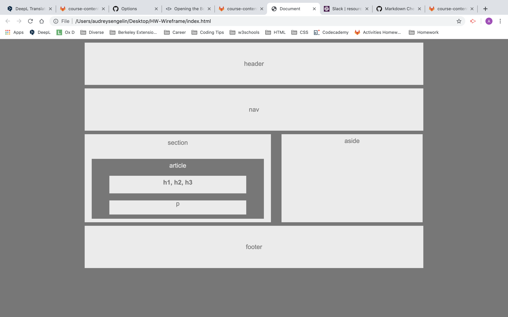

# HW-Wireframe

## Image

## Summary
I created a web design skeleton.

## Steps
- I first added different elements in a HTML page.

- Then I added a CSS sheet to style the HTML document.

- After adding backgrounds colors font colors, I mostly focused on widths, heights and paddings of the elements to made them fit in the framework.

- Each time I made changes to the local repository, I pushed them to GitHub.

- I went to my GitHub repositories. I scroll down to find the right repository.

- I deployed my site by using GitHub pages to create a live site.

## Technologies used

- HTML
- CSS
- Git
- GitHub

## Author Links
[GitHub](https://github.com/AudreySen)

